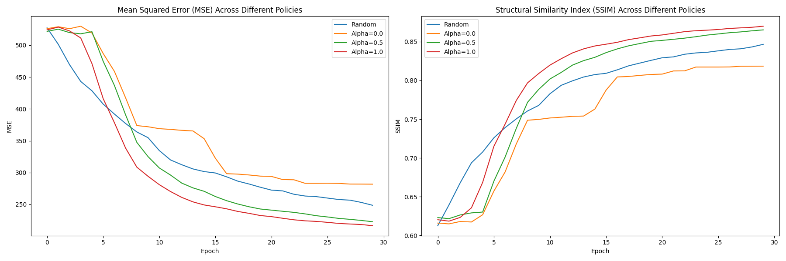

# TactileAR: Active Tactile Pattern Reconstruction

This repository contains a python implementation of our ICRA 2024 paper:

***TactileAR: Active Tactile Pattern Reconstruction***

Bing Wu and Qian Liu

Dalian University of Technology

****

**Note**: We use Gaussian degradation to simulate tactile sensors instead of using the real Xela tactile sensor in the paper.

****

## preparation
```bash
scipy==1.11.0
torch==1.9.0
pyrender==0.1.45
PyOpenGL==3.1.0
trimesh==4.3.2
imageio==2.33.1
```

****

## run test demo

```bash
python3 test_sim.py --policy active --active_alpha 0.5 --is_outVideo True --max_epoch 30  # active 

python3 test_sim.py --policy random --is_outVideo True --max_epoch 30  # random 
```

<div style="display: flex; justify-content: space-around; gap: 20px;">
  <video width="320" height="240" controls>
    <source src="./imgs/demo_random.mp4" type="video/mp4">
    Your browser does not support the video tag.
  </video>
  <video width="320" height="240" controls>
    <source src="./imgs/demo_active_0.5.mp4" type="video/mp4">
    Your browser does not support the video tag.
  </video>
</div>

****

## evaluate model

```bash
python evaluate.py
```



